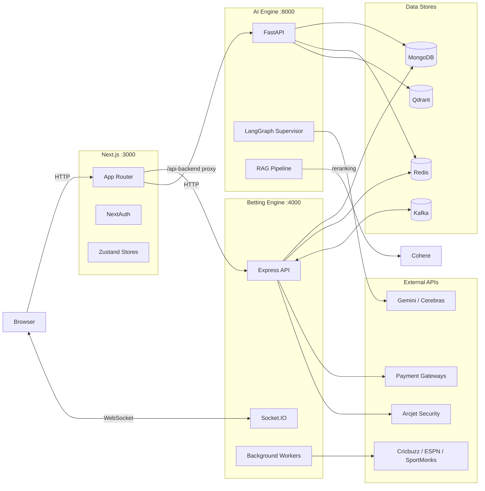
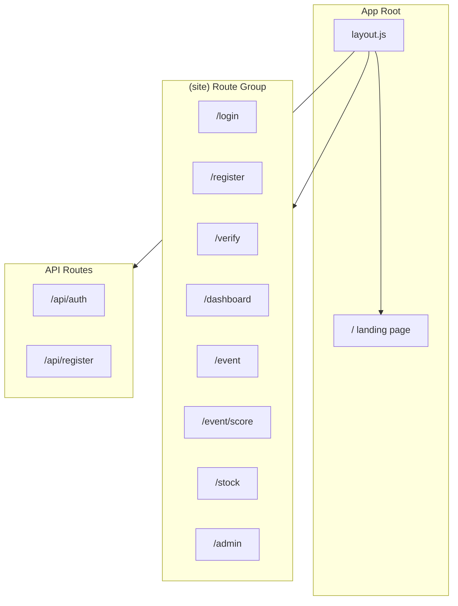
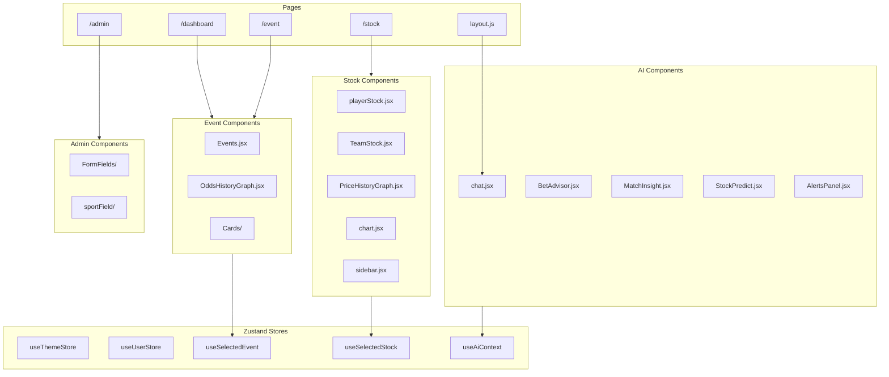
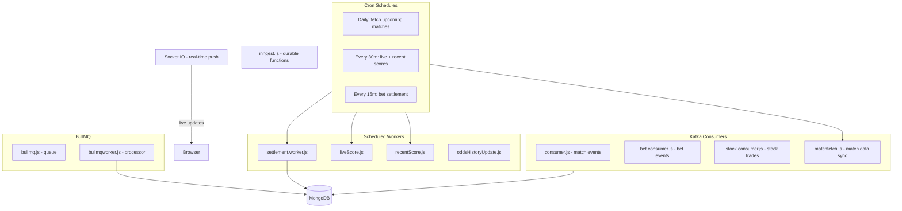
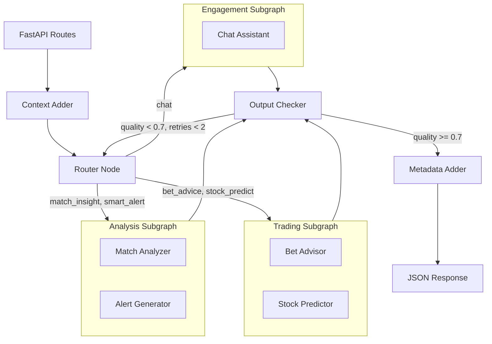
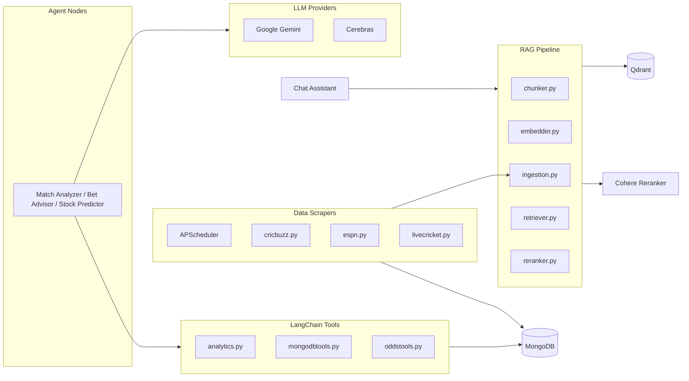
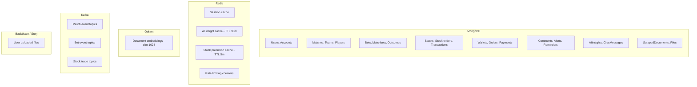
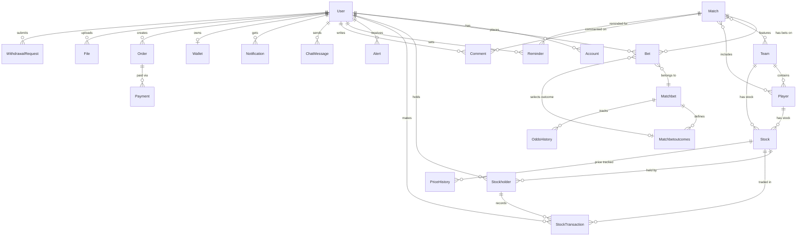

# SportsBet

A full-stack sports betting and stock trading platform with AI-powered insights. Users can bet on live cricket matches, trade player and team stocks in real time, and get intelligent predictions from a multi-agent AI system built on LangGraph.

The platform is split into three independently deployable services: a Next.js frontend, an Express betting engine, and a FastAPI AI engine. They communicate through Kafka for async event processing, Redis for caching, and Socket.IO for real-time updates.

---

## Table of Contents

- [Architecture Overview](#architecture-overview)
- [System Architecture (Deep Dive)](#system-architecture-deep-dive)
  - [Frontend Layer](#frontend-layer)
  - [Betting Engine](#betting-engine-deep-dive)
  - [AI Engine](#ai-engine-deep-dive)
  - [Data Layer](#data-layer)
- [Tech Stack](#tech-stack)
- [Project Structure](#project-structure)
- [Getting Started](#getting-started)
  - [Prerequisites](#prerequisites)
  - [Environment Variables](#environment-variables)
  - [Installation](#installation)
  - [Running Locally](#running-locally)
  - [Running with Docker](#running-with-docker)
- [API Reference](#api-reference)
- [Database Schema](#database-schema)
- [Deployment](#deployment)

---

## Architecture Overview

High-level view of how the three services interact:



---

## System Architecture (Deep Dive)

### Frontend Layer

The Next.js app uses the App Router with route groups. Pages are server-rendered where possible, with client interactivity handled through Zustand stores and Socket.IO connections.

**Routing structure:**



**Component architecture:**



### Betting Engine (Deep Dive)

The Express server handles all business logic: betting, stock trading, payments, match data fetching, and real-time communication. It uses Kafka for async processing, BullMQ for job queues, Inngest for durable functions, and Socket.IO for live updates.

**Request flow:**

```mermaid
graph LR
    Client["Client Request"]

    Client --> Middleware
    Middleware --> Routes
    Routes --> Controllers

    subgraph Middleware["Middleware"]
        JWT["verifyToken"]
        AJ["arcjet rate limiter"]
    end

    subgraph Routes["Routes"]
        direction TB
        R1["/api/bets"]
        R2["/api/stocks"]
        R3["/api/admin"]
        R4["/api/payments"]
        R5["/api/withdrawal"]
        R6["/api/alerts"]
        R7["/api/comments"]
        R8["/api/reminders"]
        R9["/api/aws"]
        R10["/api/crypto"]
        R11["/api/ai"]
        R12["/api/others"]
        R13["/api/inngest"]
    end

    subgraph Controllers["Controllers"]
        direction TB
        C1["bet.controller"]
        C2["stock.controller"]
        C3["admin.controller"]
        C4["payment.controller"]
        C5["other.controller"]
    end

    subgraph Services["Services"]
        S1["apisports.js"]
        S2["aws.client.js"]
        S3["socket.js"]
    end

    Controllers --> Services
    Controllers --> DB[("MongoDB")]
```



**Background workers and scheduled jobs:**



### AI Engine (Deep Dive)

The AI engine is a Python FastAPI service built around a LangGraph multi-agent supervisor. It uses a graph-based architecture where a supervisor routes queries to specialized subgraphs (analysis, trading, engagement), with a quality-checking reflection loop.

**LangGraph agent flow:**



**Supporting systems:**



### Data Layer



---

## Tech Stack

| Layer | Technology |
|---|---|
| Frontend | Next.js 16, React 19, Tailwind CSS 4, DaisyUI 5, Framer Motion, Recharts, Lightweight Charts |
| State Management | Zustand, React Context |
| Auth | NextAuth.js (Google OAuth + Credentials) |
| Betting Engine | Express.js, Socket.IO, node-cron |
| Async Processing | KafkaJS, BullMQ, Inngest |
| AI Engine | FastAPI, LangGraph, LangChain |
| LLMs | Google Gemini, Cerebras |
| RAG | Qdrant (vector store), Cohere (reranker) |
| Scraping | BeautifulSoup, APScheduler, feedparser |
| Database | MongoDB (via Prisma ORM) |
| Caching | Redis (ioredis / aioredis) |
| Object Storage | Backblaze B2 / Storj (S3-compatible) |
| Security | Arcjet (rate limiting, bot protection) |
| Payments | Cryptomus, CoinRemitter, Maxelpay, NOWPayments |
| Observability | LangSmith (LLM tracing) |
| Process Manager | PM2 |
| Containerization | Docker, Docker Compose |

---

## Project Structure

```
sportsbet/
|
|-- app/                          # Next.js application
|   |-- (site)/                   # Route group for authenticated pages
|   |   |-- admin/                # Admin panel
|   |   |-- dashboard/            # User dashboard
|   |   |-- event/                # Match events and scorecards
|   |   |   +-- score/            # Live score page
|   |   |-- login/                # Login page
|   |   |-- register/             # Registration page
|   |   |-- stock/                # Stock trading page
|   |   +-- verify/               # Email verification
|   |-- api/                      # Next.js API routes
|   |   |-- auth/                 # NextAuth.js handlers
|   |   +-- register/             # User registration endpoint
|   |-- components/               # React components
|   |   |-- EventComponents/      # Match event UI
|   |   |   +-- Cards/            # Event card variants
|   |   |-- StockComponents/      # Stock trading UI
|   |   |   +-- Stats/            # Player/team statistics
|   |   |-- adminComponents/      # Admin panel UI
|   |   |   |-- FormFields/       # Admin form inputs
|   |   |   +-- sportField/       # Sport-specific fields
|   |   +-- ai/                   # AI feature components
|   |       |-- AlertsPanel.jsx   # Smart alerts UI
|   |       |-- BetAdvisor.jsx    # Bet recommendations UI
|   |       |-- MatchInsight.jsx  # Match analysis UI
|   |       |-- StockPredict.jsx  # Stock prediction UI
|   |       +-- chat.jsx          # AI chat interface
|   |-- constants/                # App constants
|   |-- context/                  # React context providers
|   |-- generated/                # Prisma generated client
|   |-- lib/                      # Utility libraries
|   |   |-- aiclient.js           # AI engine HTTP client
|   |   |-- nodemailer.js         # Email service
|   |   |-- nowpayment.js         # NOWPayments client
|   |   |-- prismadb.jsx          # Prisma client singleton
|   |   +-- token.js              # JWT utilities
|   +-- store/                    # Zustand state stores
|       |-- useAiContext.jsx      # AI panel state
|       |-- useSelectedEvent.jsx  # Selected event state
|       |-- useSelectedStock.jsx  # Selected stock state
|       |-- useThemestore.jsx     # Theme state
|       +-- useUserStore.jsx      # User session state
|
|-- betting-engine/               # Express.js backend service
|   |-- controllers/              # Route handlers
|   |   |-- admin.controller.js
|   |   |-- ai.controller.js
|   |   |-- alert.controller.js
|   |   |-- aws.controller.js
|   |   |-- bet.controller.js
|   |   |-- comments.controller.js
|   |   |-- crypto.controller.js
|   |   |-- cryptomus.controller.js
|   |   |-- other.controller.js
|   |   |-- payment.controller.js
|   |   |-- reminder.controller.js
|   |   |-- stock.controller.js
|   |   +-- withdrawal.controller.js
|   |-- routes/                   # Express route definitions
|   |-- middlewares/              # Auth and security middleware
|   |   |-- verifyToken.js        # JWT verification
|   |   +-- arcjet.middleware.js  # Arcjet rate limiting
|   |-- services/                 # External service clients
|   |   |-- apisports.js          # Sports data fetcher
|   |   |-- aws.client.js         # S3-compatible storage
|   |   |-- socket.js             # Socket.IO event handlers
|   |   +-- multer.js             # File upload config
|   |-- utils/                    # Background workers
|   |   |-- kafka.js/             # Kafka consumers and producers
|   |   |   |-- producer.js
|   |   |   |-- consumer.js
|   |   |   |-- bet.consumer.js
|   |   |   |-- stock.consumer.js
|   |   |   +-- matchfetch.js
|   |   |-- bullmq.js             # BullMQ queue setup
|   |   |-- bullmqworker.js       # BullMQ job processor
|   |   |-- settlement.worker.js  # Bet settlement logic
|   |   |-- liveScore.js          # Live score fetcher
|   |   |-- recentScore.js        # Recent results fetcher
|   |   +-- oddsHistoryUpdate.js  # Odds history tracker
|   |-- inngest/                  # Inngest durable functions
|   |   +-- inngest.js
|   +-- index.js                  # Server entrypoint
|
|-- ai-engine/                    # Python FastAPI AI service
|   |-- agents/                   # LangGraph agent system
|   |   |-- supervisor.py         # Supervisor graph (orchestrator)
|   |   |-- state.py              # Shared agent state schema
|   |   |-- memory.py             # Conversation memory
|   |   |-- nodes/                # Individual agent nodes
|   |   |   |-- router.py         # Intent classification
|   |   |   |-- context.py        # Context enrichment
|   |   |   |-- matchanalyzer.py  # Match analysis agent
|   |   |   |-- betadvisor.py     # Betting advice agent
|   |   |   |-- stockpredictor.py # Stock prediction agent
|   |   |   |-- alertgenerator.py # Smart alert agent
|   |   |   +-- chatassistant.py  # General chat agent
|   |   +-- subgraph/             # Composable subgraphs
|   |       |-- analysisgraph.py  # Match + Alert pipeline
|   |       |-- tradinggraph.py   # Bet + Stock pipeline
|   |       +-- engagementgraph.py # Chat pipeline
|   |-- api/                      # FastAPI routes
|   |   |-- routes/
|   |   |   |-- health.py
|   |   |   |-- insights.py
|   |   |   |-- betAdvisor.py
|   |   |   |-- stockPredict.py
|   |   |   |-- alerts.py
|   |   |   +-- chat.py
|   |   |-- middleware.py         # Rate limiting middleware
|   |   +-- deps.py               # Dependency injection
|   |-- config/                   # Configuration
|   |   |-- settings.py           # Pydantic settings
|   |   +-- constants.py          # Intent constants
|   |-- models/                   # Pydantic schemas
|   |   +-- schemas.py
|   |-- rag/                      # Retrieval-Augmented Generation
|   |   |-- chunker.py            # Text chunking
|   |   |-- embedder.py           # Vector embedding
|   |   |-- ingestion.py          # Document ingestion pipeline
|   |   |-- retriever.py          # Similarity search
|   |   +-- reranker.py           # Cohere reranking
|   |-- scraper/                  # Sports data scrapers
|   |   |-- scheduler.py          # APScheduler setup
|   |   |-- cricbuzz.py           # Cricbuzz scraper
|   |   |-- espn.py               # ESPN scraper
|   |   +-- livecricket.py        # Live cricket data
|   |-- services/                 # External service clients
|   |   |-- mongodb.py            # Motor async MongoDB
|   |   |-- qdrantclient.py       # Qdrant vector DB
|   |   |-- redisclient.py        # Redis async client
|   |   +-- langsmithconfig.py    # LangSmith tracing
|   |-- tools/                    # LangChain tools for agents
|   |   |-- analytics.py          # Analytics computations
|   |   |-- mongodbtools.py       # Database query tools
|   |   +-- oddstools.py          # Odds calculation tools
|   |-- main.py                   # FastAPI entrypoint
|   +-- requirements.txt          # Python dependencies
|
|-- prisma/
|   +-- schema.prisma             # Database schema (MongoDB)
|
|-- components/                   # Shared UI components (shadcn/ui)
|   |-- ui/                       # Base UI primitives
|   +-- blocks/                   # Composed UI blocks
|
|-- lib/
|   +-- utils.js                  # Shared utility functions
|
|-- public/                       # Static assets
|-- .github/workflows/            # CI/CD workflows
|-- Dockerfile                    # Multi-stage Docker build
|-- docker-compose.yml            # Container orchestration
|-- ecosystem.config.cjs          # PM2 process config
|-- next.config.mjs               # Next.js configuration
|-- package.json                  # Node.js dependencies
+-- pnpm-workspace.yaml           # pnpm workspace config
```

---

## Getting Started

### Prerequisites

- Node.js 20+
- Python 3.11+
- MongoDB instance (Atlas or local)
- Redis instance
- Kafka broker (e.g., Upstash Kafka)
- Qdrant instance (cloud or local)
- pnpm or npm

### Environment Variables

Create a `.env` file in the project root. The following variables are required:

**Core:**
```
DATABASE_URL=               # MongoDB connection string
NEXTAUTH_SECRET=            # NextAuth session secret
AUTH_SECRET=                 # Auth secret
SECRET=                      # JWT signing secret
DOMAIN=                      # Application domain
NODE_ENV=                    # development / production
```

**Service URLs:**
```
FRONTEND_URL=               # Next.js URL (e.g., http://localhost:3000)
FRONTEND_URI=               # Frontend URI
BACKEND_URL=                # Betting engine URL (e.g., http://localhost:4000)
AI_ENGINE_URL=              # AI engine URL (e.g., http://localhost:8000)
SERVER_URI=                 # Server URI
NEXT_PUBLIC_API_URL=        # Public API base URL
```

**Authentication:**
```
GOOGLE_ID=                  # Google OAuth client ID
GOOGLE_SECRET=              # Google OAuth client secret
```

**Infrastructure:**
```
REDIS_URI=                  # Redis connection string
REDIS_HOST=                 # Redis host
REDIS_PORT=                 # Redis port
REDIS_USER=                 # Redis username
REDIS_PASSWORD=             # Redis password
KAFKA_HOST=                 # Kafka broker host
KAFKA_PORT=                 # Kafka port
KAFKA_URI=                  # Kafka connection URI
KAFKA_USER=                 # Kafka SASL username
KAFKA_PASS=                 # Kafka SASL password
```

**Sports Data:**
```
APISPORTS_API_KEY=          # API-Sports key
APISPORTS_API_HOST=         # API-Sports host
SPORTMONKS_API_TOKEN=       # SportMonks API token
```

**AI Engine (in `ai-engine/.env`):**
```
MONGODB_URL=                # AI engine MongoDB URL
QDRANT_HOST=                # Qdrant host
QDRANT_PORT=                # Qdrant port
QDRANT_API_KEY=             # Qdrant API key
GEMINI_API_KEY=             # Google Gemini API key
GEMINI_MODEL=               # Gemini model name
CEREBRAS_API_KEY=           # Cerebras API key
COHERE_API_KEY=             # Cohere API key
LANGCHAIN_API_KEY=          # LangSmith API key
EMBEDDING_MODEL=            # Embedding model name
```

**Object Storage:**
```
BACKBLAZE_KEY_ID=           # Backblaze B2 key ID
BACKBLAZE_APP_KEY=          # Backblaze B2 app key
BACKBLAZE_BUCKET_NAME=      # Backblaze bucket name
BACKBLAZE_ENDPOINT=         # Backblaze S3 endpoint
STORJ_ACCESS_KEY=           # Storj access key
STORJ_SECRET_KEY=           # Storj secret key
STORJ_ENDPOINT=             # Storj S3 endpoint
```

**Other:**
```
ARCJET_KEY=                 # Arcjet API key
RESEND_API_KEY=             # Resend email API key
GAUTH_EMAIL=                # Gmail address for nodemailer
GAUTH_PASSWORD=             # Gmail app password
INNGEST_EVENT_KEY=          # Inngest event key
INNGEST_SIGNING_KEY=        # Inngest signing key
MUX_TOKEN_ID=               # Mux token ID
MUX_SECRET_KEY=             # Mux secret key
```

### Installation

**1. Install Node.js dependencies:**

```bash
npm install
# or
pnpm install
```

**2. Generate the Prisma client:**

```bash
npx prisma generate
```

**3. Set up the AI engine:**

```bash
cd ai-engine
python -m venv .venv
source .venv/bin/activate        # Linux/macOS
# .venv\Scripts\activate         # Windows
pip install -r requirements.txt
```

### Running Locally

You need to start all three services:

**Terminal 1 - Next.js Frontend (port 3000):**

```bash
npm run dev
```

**Terminal 2 - Betting Engine (port 4000):**

```bash
node betting-engine/index.js
```

**Terminal 3 - AI Engine (port 8000):**

```bash
cd ai-engine
source .venv/bin/activate
uvicorn main:app --host 0.0.0.0 --port 8000 --reload
```

### Running with Docker

The Docker setup uses a multi-stage build and PM2 to run the Next.js app and betting engine together. The AI engine runs separately.

```bash
# Build and start the main services
docker-compose up --build

# Start the AI engine separately
cd ai-engine
uvicorn main:app --host 0.0.0.0 --port 8000
```

The PM2 config (`ecosystem.config.cjs`) manages two processes:
- `nextjs-app` on port 3000
- `betting-engine` on port 4000

---

## API Reference

### Betting Engine (Express, port 4000)

| Endpoint | Description |
|---|---|
| `GET/POST /api/bets/*` | Place bets, view bet history, manage bets |
| `GET/POST /api/stocks/*` | Buy/sell stocks, view holdings, price history |
| `GET/POST /api/admin/*` | Admin operations (matches, teams, players, events) |
| `GET/POST /api/payments/*` | Payment creation, verification, history |
| `GET/POST /api/withdrawal/*` | Withdrawal requests and processing |
| `GET/POST /api/alerts/*` | Price and bet alerts |
| `GET/POST /api/comments/*` | Threaded comments on matches/players/teams |
| `GET/POST /api/reminders/*` | Match and event reminders |
| `GET/POST /api/aws/*` | File upload/download via S3-compatible storage |
| `GET/POST /api/crypto/*` | Cryptocurrency payment processing |
| `GET/POST /api/ai/*` | Proxy to AI engine endpoints |
| `GET/POST /api/others/*` | Miscellaneous (matches, teams, players, search) |
| `POST /api/inngest` | Inngest webhook endpoint |

### AI Engine (FastAPI, port 8000)

| Endpoint | Description |
|---|---|
| `GET /api/health` | Health check and service status |
| `POST /api/insights` | Match analysis and predictions |
| `POST /api/betadvisor` | AI-powered betting recommendations |
| `POST /api/stockpredict` | Player/team stock price predictions |
| `POST /api/alerts` | Smart alert generation |
| `POST /api/chat` | Conversational AI assistant |

---

## Database Schema

The application uses MongoDB through Prisma ORM. Key models and their relationships:



**Key Models:** User, Match, Team, Player, Stock, Stockholder, StockTransaction, Bet, Matchbet, Matchbetoutcomes, Wallet, Order, Payment, Alert, Reminder, Comment, Notification, ChatMessage, AIInsight, ScrapedDocument, PriceHistory, OddsHistory, WithdrawalRequest, File, VerificationToken

---

## Deployment

The application is designed for split deployment:

- **Frontend (Next.js):** Vercel (configured via `.vercel/` and `.vercelignore`)
- **Betting Engine:** Any Node.js host (Render, Railway, EC2). The Next.js config proxies `/api-backend/*` to the betting engine URL.
- **AI Engine:** Any Python host with GPU access optional (Render, Railway, EC2). Runs on port 8000.
- **Full Stack (Docker):** Use `docker-compose up` to run the Next.js app and betting engine together with PM2. The AI engine runs as a separate container or process.

Required infrastructure services:
- MongoDB (Atlas recommended)
- Redis (Upstash, Redis Cloud, or self-hosted)
- Kafka (Upstash Kafka or self-hosted)
- Qdrant (Qdrant Cloud or self-hosted)
